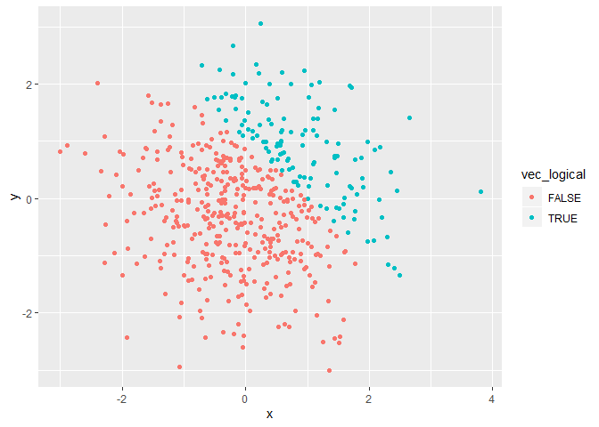
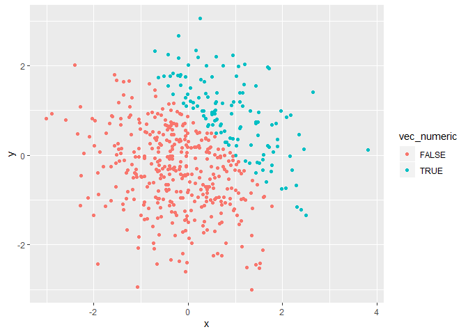
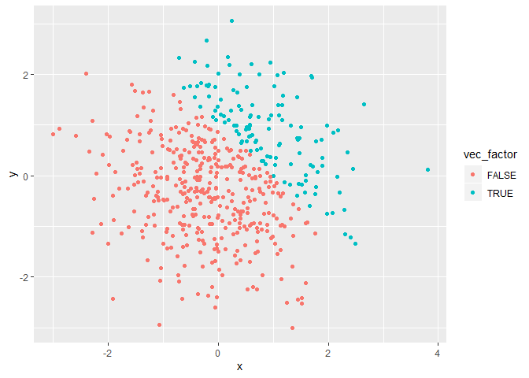

Homework1
================
Harsha Senapathi, svs2130
9/20/2019

## Loading required Library

``` r
# Loading Library
library(tidyverse)
```

    ## -- Attaching packages -------------------------------------------------------------------------------- tidyverse 1.2.1 --

    ## v ggplot2 3.2.1     v purrr   0.3.2
    ## v tibble  2.1.3     v dplyr   0.8.3
    ## v tidyr   0.8.3     v stringr 1.4.0
    ## v readr   1.3.1     v forcats 0.4.0

    ## -- Conflicts ----------------------------------------------------------------------------------- tidyverse_conflicts() --
    ## x dplyr::filter() masks stats::filter()
    ## x dplyr::lag()    masks stats::lag()

# Problem 1

## Creating a data frame and calculating the means of all the variables

``` r
# Problem 1
# Creating a data frame

set.seed(10)
problem1_df= tibble(
  random = rnorm(8),
  vec_logical = random > 0,
  vec_char = c("a", "b", "c", "d", "e", "f", "g", "h"),
  vec_factor = as.factor(c(1,2,3,1,1,2,3,2))
)

# Since the argument is numeric, we get a value.
# Works, we get a value.
mean(pull(problem1_df, random)) 
```

    ## [1] -0.3779272

``` r
# Since the argument is logical, we get a value.
# Works, We get a value.
mean(problem1_df$vec_logical)
```

    ## [1] 0.375

``` r
# Since the argument isn't numeric or logical, the result is NA.
# Doesnt work, we get NA.
mean(problem1_df$vec_char)
```

    ## [1] NA

``` r
# Since the argument is neither numberic nor logical, the result is NA
# Doesnt work, we get NA
mean(problem1_df$vec_factor) 
```

    ## [1] NA

``` r
# Coercing the character variables as numeric.
# It doesn't work because cannot take mean of characters.
mean(as.numeric(problem1_df$vec_char))
```

    ## [1] NA

``` r
# Coercing factor vector as numeric.
# It works we get a value.
mean(as.numeric(problem1_df$vec_factor))
```

    ## [1] 1.875

## Using variables from the dataframe **problem1\_df** Multiplying different variables

``` r
# second code chunk

# Coercing logical vector as numeric and multiplying with Random variable
as.numeric(problem1_df$vec_logical)*(problem1_df$random)
```

    ## [1] 0.01874617 0.00000000 0.00000000 0.00000000 0.29454513 0.38979430
    ## [7] 0.00000000 0.00000000

``` r
# Coercing logical vector as factor and multiplying with Random variable
as.factor(problem1_df$vec_logical)*(problem1_df$random)
```

    ## [1] NA NA NA NA NA NA NA NA

``` r
# Coercing factor of logical vector as numeric and multiplyng with random
as.numeric(as.factor(problem1_df$vec_logical))*(problem1_df$random)
```

    ## [1]  0.03749234 -0.18425254 -1.37133055 -0.59916772  0.58909025  0.77958860
    ## [7] -1.20807618 -0.36367602

# Problem \#2

## Creating ggplots

### Creating a new dataframe

``` r
# Creating dataframe
set.seed(1)
problem2_df = tibble(
  x = rnorm(500),
  y = rnorm(500),
  vec_logical = c(x + y > 1),
  vec_numeric = c(vec_logical),
  vec_factor = c(vec_logical)
)
```

### A short description of our dataframe

  - The number of rows in our data set is **500**.
  - The number of columns in our dataset is **5**.
  - The mean, median and Standard deviation of *x* are **0.0226441,
    -0.0367783 and 1.0119283** respectively
  - The proportion of cases for which the logical vector(x + y \> 1) is
    true: **0.252**.

### Using the above dataframe **problem2\_df** to create Scatter Plots

``` r
# Creating a scatter plot of the logical vector
ggplot(problem2_df, aes(x = x, y = y, color = vec_logical)) + geom_point()
```

<!-- -->

``` r
# Saving the ggplot as a png file
ggsave(filename = "C:/Users/shvar/OneDrive - cumc.columbia.edu/Data Science/P8105_HW/problem2_df_color_logical_ggplot.png")
```

    ## Saving 7 x 5 in image

``` r
# Creating a scatter plot using the numeric vector
ggplot(problem2_df, aes(x = x, y = y, color = vec_numeric)) + geom_point()
```

<!-- -->

``` r
# Creating a scatter plot using the factor vector
ggplot(problem2_df, aes(x = x, y = y, color = vec_factor)) + geom_point()
```

<!-- -->
